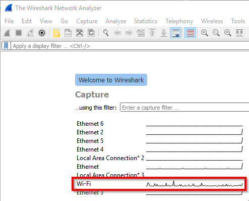
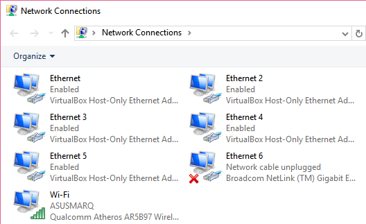
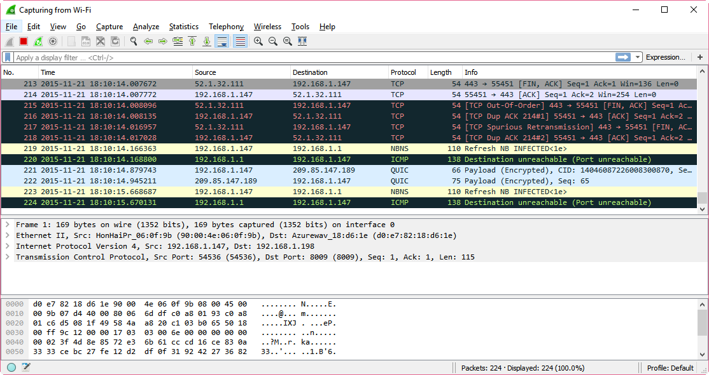

Wireshark for Network Packet Analysis
=====================================

Wireshark is a took for analyzing network traffic. It is a free, open source program used widely by networking professionals. Wireshark has a sophisticated user interface. But, with a little training, you should understand how to take advantage of Wireshark's core features.

This lab will introduce you to Wireshark 2. If you have a previous version of Wireshark, you should install the latest version.

Prerequisites
----------------
A computer with an Internet connection

Download
--------------

1. Download the latest release from https://www.wireshark.org/download.html
  - Use the 64-bit version if you have a 64-bit operating system.
2. When installing, keep all defaults. Ensure that you install WinPcap that comes packed with Wireshark. Without WinPcap, Wireshark will not work.
  - You may be prompted to uninstall the previous versions of Wireshark or WinPcap. Uninstalling the previous version will not harm your computer. The newer version of Wireshark will be able to open up files captured with previous versions of Wireshark.

Wireshark Main Screen
----------------------
When Wireshark starts, you will see a list of network interfaces. A typical laptop will have an Ethernet connection and a WiFi connection. However, you might have more network adapters if you use virtualization technology like VirtualBox. Also, you might have network adapters for virtual private network (VPN) connections.

&nbsp;

The following screenshot shows the Windows network connections.

&nbsp;

The first issue Wireshark beginners face is determining on which card to capture network traffic. Wireshark shows a small graph that indicates how active the network adapters currently are. In the screenshot above, the WiFi adapter has the most traffic, indicating that it is probably the network adapter I should use to capture traffic.

However, there are cases when an adapter other than the most active should be used. For example, you might be connected to a switch with a wired Ethernet connection while also connected to a wireless network. If the two network adapters have IP addresses in different subnetworks, then judgment must be exercised when choosing the adapter to use to capture traffic.

Consider the following example. Susan is connected to a wireless network and a wired network. The IP address of her WiFi adapter is 192.168.10.200. The IP address of her Ethernet adapter is 10.0.10.200. If Susan wants to capture a `ping` request to 10.0.10.150, she should capture traffic on the Ethernet adapter. If she captured traffic on the wireless adapter, she would not see any traffice on the 10.0.10.0 network.

Capturing Traffic
----------------------
Traffic can be captured by double-clicking on a network adapter. Wireshark will begin to capture packets. Depending on the amount of traffic, it may be very difficult to visually inspect the packets as they are recorded. The packets will be captured until you stop the capture.

&nbsp;

The capture can be stopped in few ways:
  - Click the red square button.
  - Choose Capture > Stop from the menu.
  - Use the [Control]+e keyboard shortcut.

Certain user interface featurse (like column sorting) may not work while a capture is active.

It is generally a best practice to capture the least amount of data as possible. This will make the job of analyzing the captured packets much easier.

